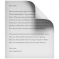

<div class="hero" align="center">



# sitedown

Sitedown is a minimal [Markdown](https://www.markdownguide.org/getting-started/)-based static site generator.

[![npm][npm-image]][npm-url]
[![build][build-image]][build-url]
[![downloads][downloads-image]][npm-url]

[npm-image]: https://img.shields.io/npm/v/sitedown.svg
[npm-url]: https://www.npmjs.com/package/sitedown
[build-image]: https://github.com/ungoldman/sitedown/actions/workflows/tests.yml/badge.svg
[build-url]: https://github.com/ungoldman/sitedown/actions/workflows/tests.yml
[downloads-image]: https://img.shields.io/npm/dm/sitedown.svg

</div>

## Overview

Sitedown turns a folder with Markdown files into a static HTML site.

```
.                              build/
├─ README.md         ==>       ├─ index.html
├─ about.md          ==>       └─ about/
│                              │  └─ index.html
│                              │
├─ docs/                       └─ docs/
│  ├─ README.md      ==>       │  ├─ index.html
│  └─ ref.md         ==>       │  └─ ref/
│                              │     └─ index.html
│                              │
└─ assets/                     └─ assets/
   └─ cat.jpg        ==>          └─ cat.jpg
```

It takes all markdown files in the current folder (and subfolders) and generates a new site in the `build` directory.

- Converts `README.md` files into indexes (`index.html`).
- Creates directory indexes for pretty URLs (`CHANGELOG.md` => `changelog/index.html`).
- Supports custom layouts (comes with a default `layout.html`).
- Copies assets (defaults to copying over contents of `assets` folder).
- Comes with a `dev` mode that starts a server and watches for changes for easy local development.

Sitedown's [website](https://ungoldman.github.io/sitedown) was built with sitedown, so you know it's *for real*.

Read the [Usage](#usage) section for a full overview of options and defaults.

## Install

```
npm install sitedown
```

## Usage

### CLI

```console
Usage: sitedown [source] [options]

    Example: sitedown . -b dist -l layout.html

    source                path to source directory (default: current working directory)
    --build, -b           path to build directory (default: "build")
    --pretty              use directory indexes for pretty URLs (default: true)
    --el, -e              css selector for target element (default: ".markdown-body")
    --layout, -l          path to layout file
    --github-headings, -g add anchors to headings just like GitHub (default: false)
    --no-hljs-class       don't add the hljs class to codeblocks (default: false)
    --silent, -s          make less noise during build
    --watch, -w           watch a directory or file (experimental)
    --dev, -d             start development server (experimental) (default: false)
    --assets, -a          assets folder to copy (default: "assets")
    --version, -v         show version information
    --help, -h            show help
```

### Node API

```js
var sitedown = require('sitedown')

var options = {
  source: '.',            // path to source directory                 default: cwd
  build: 'build',         // path to build directory                  default: 'build' in cwd
  pretty: true,           // use directory indexes for pretty URLs    default: true
  el: '.markdown-body',   // css selector for target element          default: '.markdown-body'
  layout: 'layout.html',  // path to layout                           default: none
  githubHeadings: false,  // add anchors to headings just like GitHub default: false
  noHljsClass: false,     // don't add hljs class to codeblocks       default: false
  silent: false           // make less noise during build             default: false
}

sitedown(options, function (err) {
  if (err) return console.error(err)
  console.log('success')
})
```

### Layout

All files are wrapped in a `layout.html` file. Markdown content is appended to the first `.markdown-body` element, and the page title (`<title>` in `<head>`) is set to the text of the first `h1` element.

The default layout is:

```html
<!DOCTYPE html>
<html lang="en">
  <head>
    <meta charset="utf-8">
    <meta name="viewport" content="width=device-width, initial-scale=1">
    <title></title>
    <link rel="stylesheet" href="https://unpkg.com/style.css">
  </head>
  <body>
    <main class="markdown-body"></main>
  </body>
</html>
```

The default layout comes bundled with [`style.css`](https://css-pkg.github.io/style.css), a classless stylesheet for markdown documents.

### Directory indexes (pretty URLs)

Markdown files (`$f.md`, `$f.markdown`) are lowercased and parsed into `$f/index.html` files. Directory indexes can be disabled with the `pretty: false` option. `README.md` files are always converted to directory indexes (`index.html`).

### Links

Relative links that point to markdown files (`$f.md`, `$f.markdown`) are rewritten as `$f/` to point to their `$f/index.html` equivalent.

## Contributing

Contributions welcome! Please read the [contributing guidelines](CONTRIBUTING.md) first.

## License

[ISC](LICENSE.md)

Page image is from [emojipedia](https://emojipedia.org/page-facing-up/).
